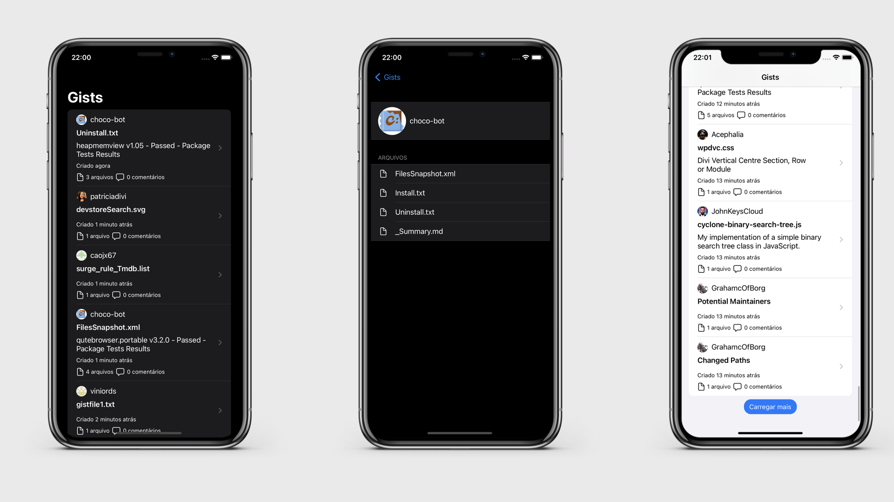
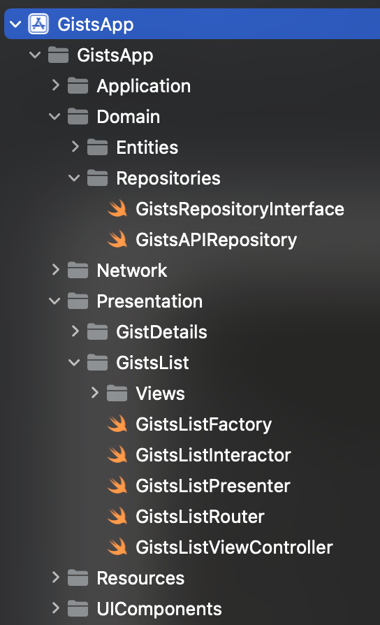

# Gists App

Aplicativo simples e elegante que consome a API pública de listagem de Gists do Github.  
Possui duas telas: uma com a lista dos Gists e outra com detalhes do Gist.  

## Interface

## Features

- [x] Listagem paginada dos Gists
- [x] Carregar mais Gists
- [x] Tratamento de erro vindo da API
- [x] Tela de detalhes
- [x] Suporte para light e dark mode

## Estrutura do projeto e Arquitetura
O projeto foi desenvolvido adotando conceitos da Clean Architecture e VIPER. Existindo três grandes "camadas":
- Network: Modelos da resposta da API + Chamada a API. Essa camada é responsável por fazer conexão com a API.
- Domain: Entidades usadas no contexto da aplicação + Repositório dos dados. Essa camada armazena os modelos do Gist, User e File contendo apenas os campos necessários para o contexto da aplicação. Utiliza Repository Pattern para recuperar os dados da camada inferior de Network.
- Presentation: Interface do usuário, usando VIPER. Essa camada cria todas as telas do App de maneira modularizada.

  

## Detalhes de implementação
O aplicativo foi todo desenvolvido utilizando UIKit, mais especificamente com o componente UITableView, com suporte ao **iOS 13** +.  
  
Na tela de listagem dos Gists optei por uma implementação mais atual, utilizando **UITableViewDiffableDataSource** para lidar com o preenchimento e atualização dos dados exibidos pela UITableView.  
  
Já na tela de detalhes utilizei a maneira mais usual via **UITableViewDataSource**.  
  
A **injeção de dependência** é feito por meio do padrão **Factory**. A Factory de cada uma das telas do App é reponsável por instaciar todos os componentes VIPER e injetar suas dependências.  

**Todas** as camadas da aplicação foram testadas via testes unitários (XCTests).  
Nos testes utilizei dados mockados para não precisar ir até a API, para isso interceptei os requests e retornei a response que desejava para cada um dos testes.  
Além disso, por ter adotado progamação orientada a interface, foi possivel mockar componentes da arquitetura VIPER durante os testes.
